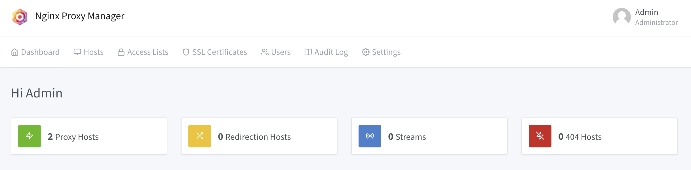
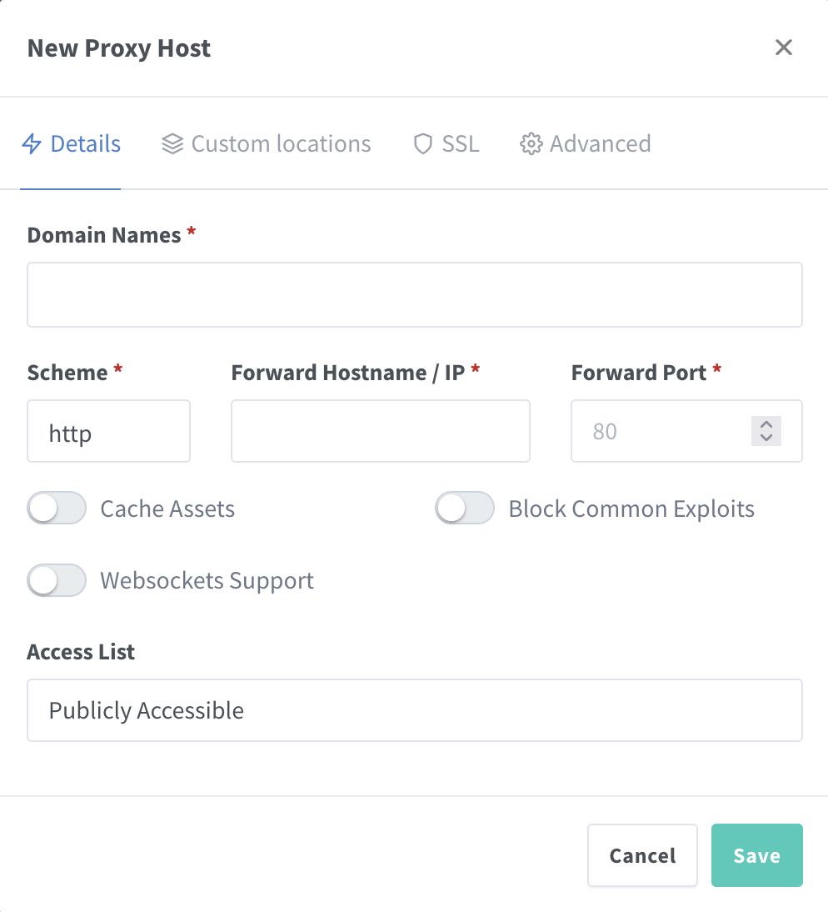

## Uso de NGINX Proxy Manager y DuckDNS para exponer aplicaciones locales utilizando SSL con Docker 

 NGINX es un **servidor web** que permite el uso como *proxy inverso*. NGINX Proxy Manager es un GUI que permite 
crear y administrar servicios o hosts detras del proxy con cobertura HTTPS, es decir, nos permite implementar 
certificados TLS en el proxy para no tener que hacer dicha configuración en cada uno de los servicios externos
que queremos exponer

 

NPM (Nginx Proxy Manager) usa internamente `Let's Encrypt` para gestionar y solicitar los certificados TLS que se 
aplicarán en cada servicio.

Para la configuracioón DNS vamos a utilizar DuckDNS, que es un servicio de DNS dinámico gratuito que nos permite 
registrar hasta 5 subdominios.
 
Para implementar estos servicios vamos a usar Docker Compose

## NGINX Proxy Manager

Para crear el contenedor de NPM creamos una carpeta para generar el archivo docker-compose.yml

```console
$ mkdir nginx-proxy-manager
$ cd nginx-proxy-manager

```
El contenido del archivo será el siguiente:

```docker

version: '3.8'
services:
  app:
    image: 'jc21/nginx-proxy-manager:latest'
    restart: unless-stopped
    ports:
      # These ports are in format <host-port>:<container-port>
      - '80:80' # Public HTTP Port
      - '443:443' # Public HTTPS Port
      - '81:81' # Admin Web Port
      # Add any other Stream port you want to expose
      # - '21:21' # FTP

    # Uncomment the next line if you uncomment anything in the section
    # environment:
      # Uncomment this if you want to change the location of
      # the SQLite DB file within the container
      # DB_SQLITE_FILE: "/data/database.sqlite"

      # Uncomment this if IPv6 is not enabled on your host
      # DISABLE_IPV6: 'true'

    volumes:
      - ./data:/data
      - ./letsencrypt:/etc/letsencrypt
```

Esta es la configuración básica minima, con una base de datos sqlite, no hace uso de una base de datos MariaDB que 
sería una configuración mas avanzada.

Para que funcione correctamente debemos abrir los puertos 80 y 443 en nuestro router apuntando a la maquina docker.
En los comentarios del mismo archivo docker-compose.yml se explica basicamente el funcionamiento del mismo.

Para mas información sobre instrucciones de configuración podeis revisar la documentación oficial:

[Full Setup Instructions](https://nginxproxymanager.com/setup/)

Para crear el contenedor ejecutamos:

```console
$ docker compose up -d

```
Podemos acceder a NPM a través del puerto 81 (http://IP:81) y comenzar la configuración.

El usuario inicial es `admin@example.com` y su contraseña es `changeme`.

Una vez iniciada la sesión, se editan los datos del usuario y se cambia la contraseña por defecto.

Antes de crear un host con certificado apuntando a alguno de nuestros servicios vamos a configurar DuckDNS

## DUCK DNS

### Alta en DuckDNS

Accedemos a la web [Duck DNS](https://www.duckdns.org) y nos registramos, con alguna de las cuentas permitidas (google, twitter, github...)

Reservamos nuestros nombres de subdominios, hasta 5 en total y anotamos nuestro token para emplearlo despues.


Creamos carpeta para almacenar el archivo docker-compose.yml

```console
$ mkdir duckdns
$ cd duckdns

```
El archivo de creación del contenedor de duckdns es el siguiente:

```docker
version: "3"

services:
  duckdns:
    image: lscr.io/linuxserver/duckdns:latest
    container_name: duckdns
    network_mode: host #optional
    environment:
      - PUID=1000 #optional
      - PGID=1000 #optional
      - TZ=Europe/Madrid #optional
      - SUBDOMAINS=subdominio1, subdominio2, ... , subdominio5
      - TOKEN=token-copiado-de-la-web-duckdns
      - LOG_FILE=false #optional
    volumes:
      - /path/to/duckdns/config:/config #optional
    restart: unless-stopped

```
Lanzamos el contenedor y volvemos a Nginx Proxy Manager.



Vamos a crear nuevo host, podemos acceder desde el dashboard o desde el menu superior, desde Hosts hacemos click en Add Proxy Host



En Domain names introducimos nuestro subdominio registrado en duckdns, como por ejemplo subdominio1.duckdns.org, en Fordward Hostname / IP introducimos la dirección IP del servidor de Docker y en Forward Port el puerto del servicio a exponer.

Ahora accedemos a SSL


El SSL Certificate dejamos la opcion Request a new SSL Certificate (Let`s Encrypt) y activamos las 4 casillas tal y como se muestra en la imagen. Completamos con nuestro email y aceptamos las condiciones del servicio. Guardamos

Si el proceso termina correctamente veremos los hosts creados en nuesto NPM (en la imagen los nombres de los hosts han sido borrados)


